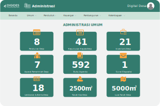
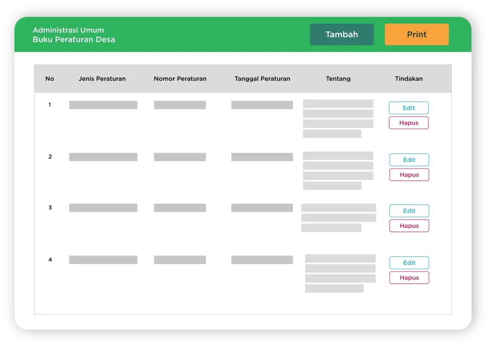
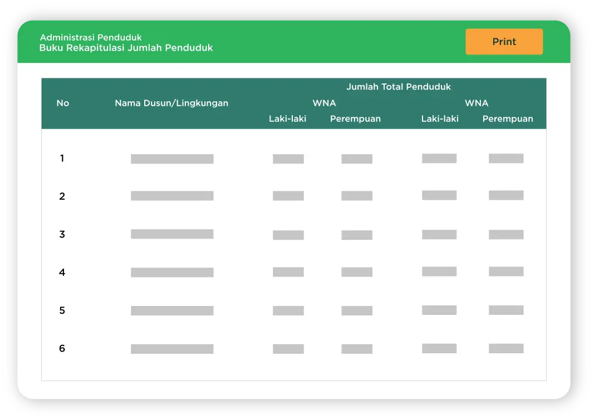
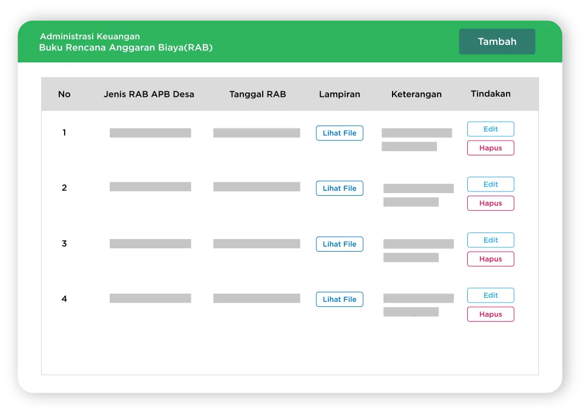
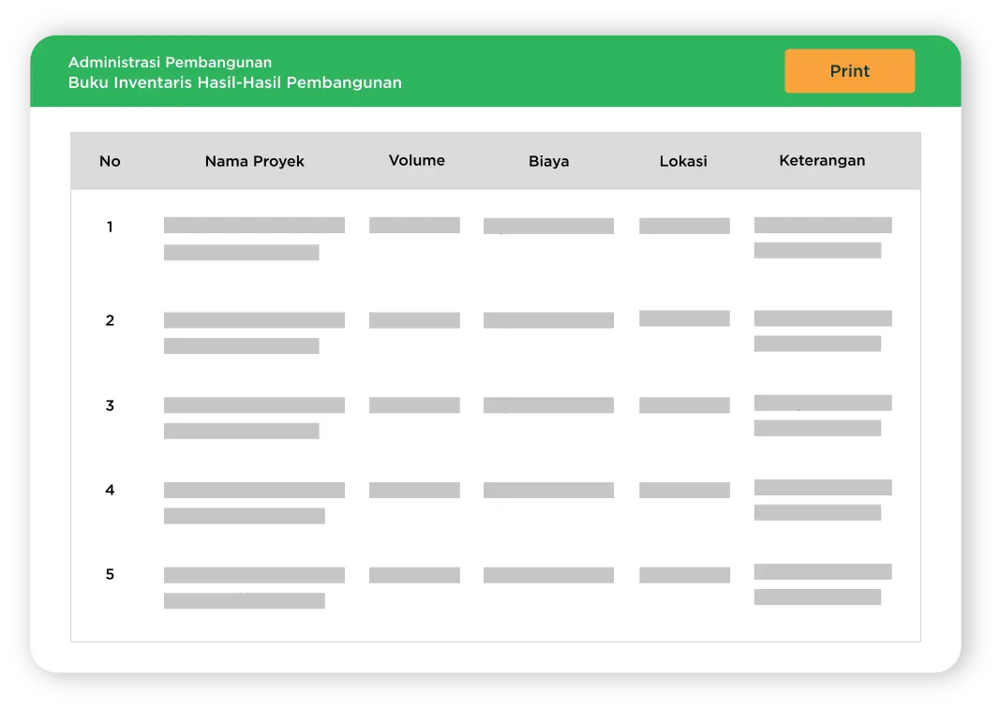
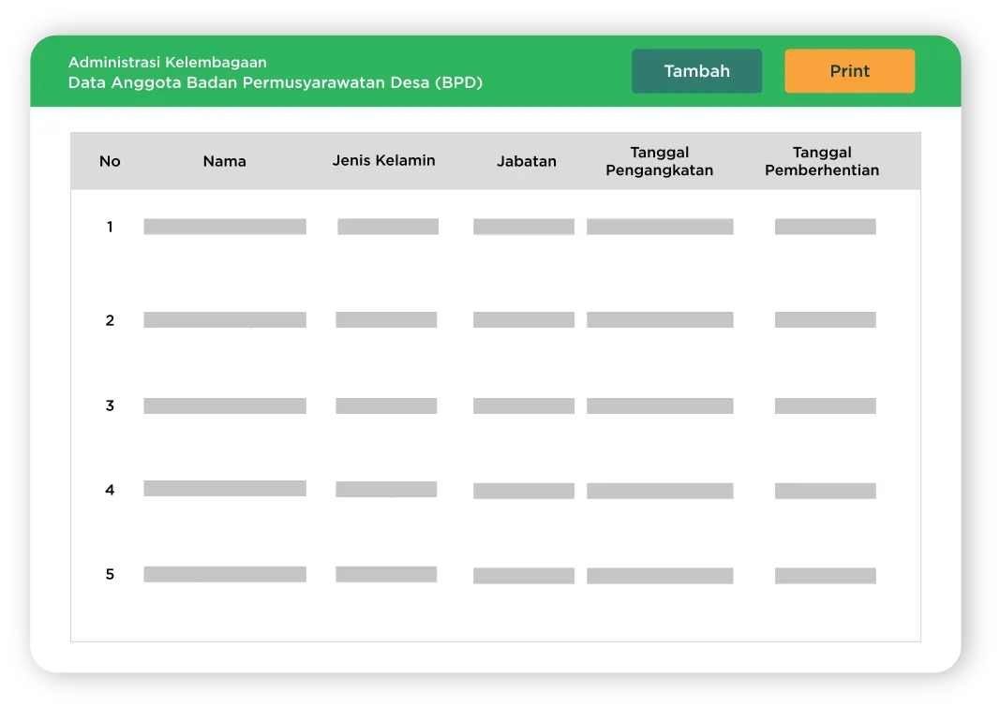

---

title: Administrasi Desa
summary: >
  Sebuah aplikasi layanan yang memberikan pelayanan begitu efektif bagi perangkat desa untuk bekerja 
  lebih maksimal sehingga menghasilkan pekerjaan yang lebih baik.
icon:
  src: solution/digides_administrasi.svg
  width: 70%

---

<feature-section id="utama">
<feature-image>

</feature-image>

# Administrasi Desa

Aplikasi administrasi desa yang dapat digunakan secara mandiri oleh perangkat desa. 
Bermanfaat untuk mendukung fungsi dan tugas kantor desa, termasuk administrasi kependudukan, 
perencanaan, pelaporan, pengelolaan asset, pengelolaan anggaran, aplikasi pelayana desa, 
aplikasi surat menyurat desa dan lain sebagainya

</feature-section>

## Fitur

<feature-section id="umum">
<feature-image>

</feature-image>

### Administrasi Umum

Digides merupakan platform tata kelola desa yang menawarkan sejumlah layanan seperti sistem informasi 
pembangunan desa, administrasi, kependudukan, pelayanan publik, anggaran, dan berbagai layanan lainnya.

- Buku Peraturan di Desa
- Buku Keputusan Kepala Desa
- Buku Inventaris dan Kekayaan Desa
- Buku Aparat Pemerintah Desa
- Buku Tanah Kas Desa
- Buku Tanah di Desa
- Buku Agenda
- Buku Ekspedisi
- Buku Lembaran Desa dan Berita Desa

</feature-section>

<feature-section id="penduduk">
<feature-image>

</feature-image>

### Administrasi Penduduk

Sistem informasi kependudukan desa mempermudah dalam pencatatan data dan informasi mengenai 
kependudukan pada Buku Administrasi Penduduk.

- Buku Induk Penduduk
- Buku Mutasi Penduduk Desa
- Buku Rekapitulasi Jumlah Penduduk
- Buku Penduduk Sementara
- Buku KTP dan Buku KK

</feature-section>

<feature-section id="keuangan">
<feature-image>

</feature-image>

### Administrasi Keuangan

Administrasi Keuangan yaitu kegiatan pencatatan data dan informasi mengenai pengelolaan keuangan Desa 
pada Buku Administrasi Keuangan.

- Buku APB Desa
- Buku Rencana Anggaran Biaya
- Buku Kas Pembantu Kegiatan
- Buku Kas Umum
- Buku Kas Pembantu
- Buku Bank Desa

</feature-section>

<feature-section id="pembangunan">
<feature-image>

</feature-image>

### Administrasi Pembangunan

Administrasi Pembangunan adalah kegiatan pencatatan data dan informasi pelaksanaan pembangunan dan 
pemberdayaan masyarakat pada Buku Administrasi Pembangunan.

- Buku Rencana Kerja Pembangunan
- Buku Kegiatan Pembangunan
- Buku Inventaris Hasil Pembangunan
- Buku Kader Pemberdayaan Masyarakat

</feature-section>

<feature-section id="kelembagaan">
<feature-image>

</feature-image>

### Administrasi Kelembagaan

Administrasi Kelembagaan adalah kegiatan pencatatan data dan informasi mengenai 
penyelenggaraan kegiatan kelembagaan pada Buku Administrasi Kelembagaan.

- Data Anggota PKK
- Data Anggota LPMD
- Data Anggota Karang Taruna
- Data Anggota Posyandu
- Data Anggota BPD
- Buku Keputusan BPD
- Buku Kegiatan BPD
- Buku Agenda BPD

</feature-section>

