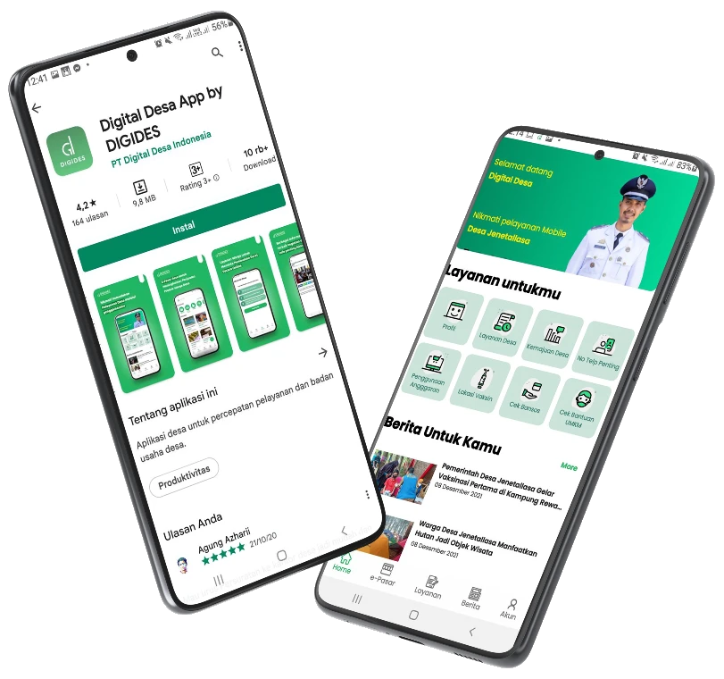

---

title: Android App
summary: >
  Miliki halaman website yang mempesona yang memuat profil website Anda, produk andalan, 
  serta wisata desa Anda.
icon:
  src: solution/digides_app.svg
  width: 70%

---

import {  RiNewspaperFill, 
  RiShoppingCart2Fill,
  RiMailSendFill,
  RiLandscapeFill,
  RiPhoneFill,
  RiUserVoiceFill
} from "react-icons/ri"
import { Icon } from '@chakra-ui/react'

<feature-section id="utama">

# Hadirkan informasi dan layanan desa di ponsel warga Anda

<feature-image>

</feature-image>

Digides telah mempunyai aplikasi Android yang dapat diakses secara gratis melalui ponsel warga desa.
Dengan aplikasi Digides, warga dapat mengakses informasi mengenai desa, memanfaatkan fitur marketplace 
yang terintegrasi di dalamnya, dan mengurus berbagai layanan kependudukan hanya dengan beberapa usapan 
dan ketukan di layar ponsel warga Anda.

</feature-section>
<section align-items="flex-start" width="100%">

### Fitur Aplikasi

<ul list-style-type="none" sx={{
  '& svg': {
    width: 7,
    height: 7,
    mr: 5,
  },
  '& li': {
    mt: 3
  }
}} font-size="20">
  <li><Icon as={RiNewspaperFill}/> Berita Desa</li>
  <li><Icon as={RiShoppingCart2Fill}/> e-Pasar (<em>Marketplace</em>)</li>
  <li><Icon as={RiMailSendFill}/> Request Persuratan</li>
  <li><Icon as={RiLandscapeFill}/> Wisata Desa</li>
  <li><Icon as={RiPhoneFill}/> Nomor Telepon Penting Desa</li>
  <li><Icon as={RiUserVoiceFill}/> Sambutan Kepala Desa</li>
</ul>

</section>