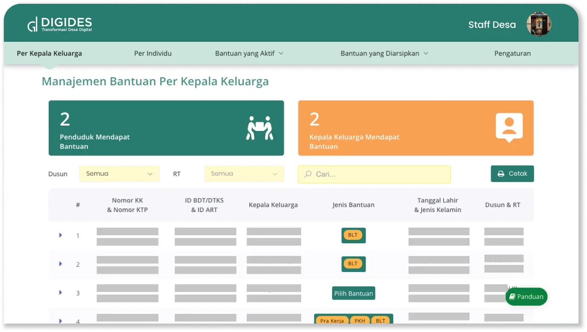
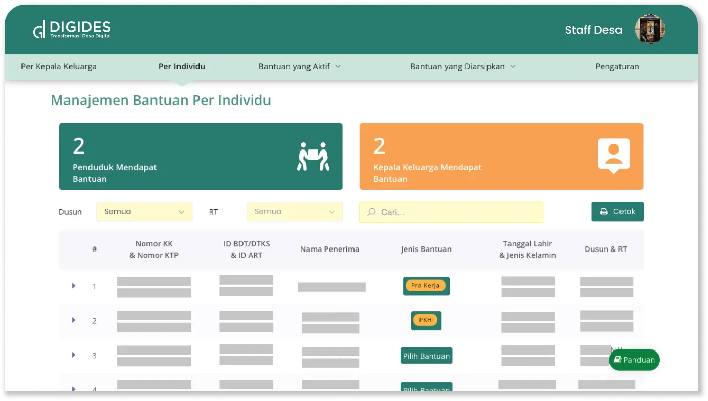
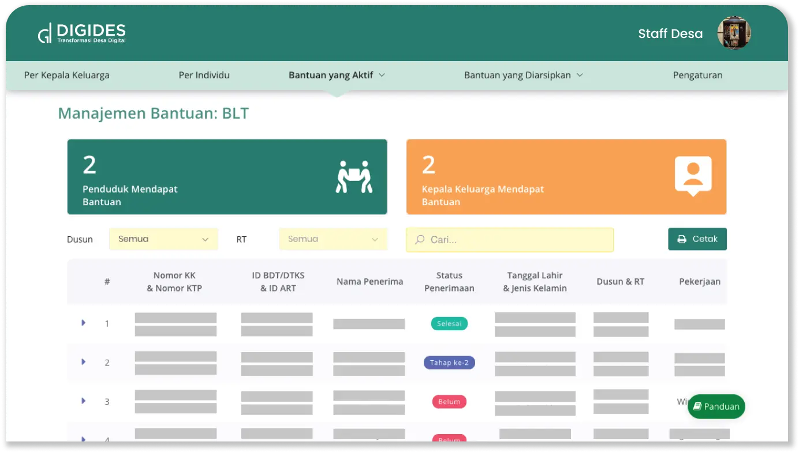
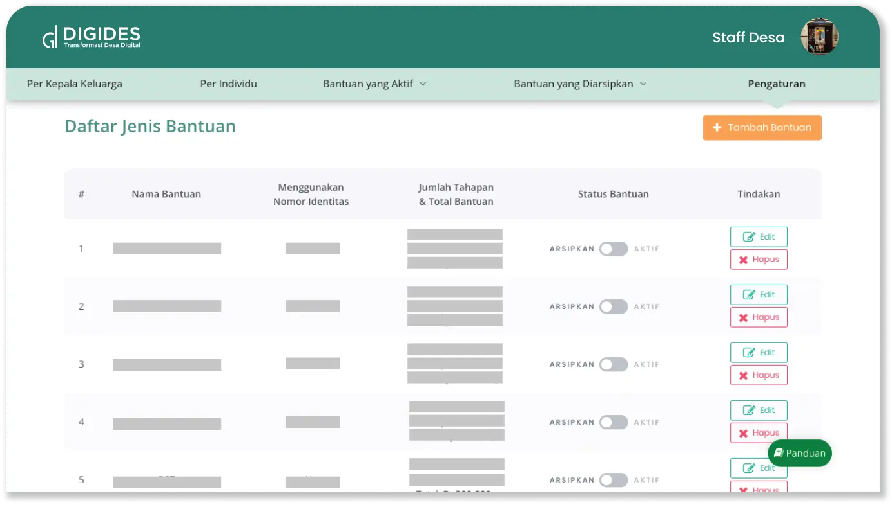

---

title: Bantuan Sosial Desa
summary: >
  Layanan khusus untuk menyimpan dan mengelola data penerima bantuan sosial dari pemerintah. 
  Layanan ini memudahkan Anda mengetahui siapa saja yang telah menerima bantuan dan lain-lain.
icon:
  src: solution/digides_bansos.svg
  width: 50%

---

<feature-section id="utama">

# Bantuan Sosial Desa

<feature-image>

</feature-image>

BANSOS DIGIDES adalah layanan khusus untuk menyimpan dan mengelola data penerima bantuan sosial dari 
pemerintah. Layanan ini memudahkan Anda mengetahui siapa saja yang telah menerima bantuan dan jenis 
bantuan yang telah diterima baik secara individu maupun keluarga. Selain itu, Anda juga dimudahkan untuk 
dapat mengatur sendiri nama jenis bantuan

</feature-section>

## Fitur

<feature-section id="keluarga">

### Manajemen Bantuan Perkepala keluarga

<feature-image>

</feature-image>

Menampilkan daftar penerima bantuan sosial yang diwakili oleh kepala keluarga. 
Selain jenis bantuan yang diterima, fitur ini juga menampilkan data lengkap kepala 
keluarga hingga nomor ID dari Bantuan

</feature-section>
<feature-section id="individu">

### Manajemen Bantuan Perindividu

<feature-image>

</feature-image>

Menampilkan daftar penerima bantuan secara perseorangan. Fitur ini akan memudahkan 
Anda untuk melakukan pendataan secara mandiri mengenai siapa saja yang telah 
menerima bantuan sosial.

</feature-section>
<feature-section id="bantuan">

### Manajemen Perjenis Bantuan

<feature-image>

</feature-image>

Fitur ini memudahkan Anda untuk mengetahui status penerima bantuan tertentu. 
Anda dapat mengambil langkah tepat untuk memberikan solusi terkait kondisi lapangan 
sehingga dapat mempercepat penyaluran bantuan

</feature-section>
<feature-section id="jenis-bantuan">

### Manajemen Jenis Bantuan

<feature-image>

</feature-image>

Fitur ini memudahkan Anda untuk mengkategorikan berbagai jenis bantuan yang ada 
dengan menambah atau menghapusnya secara mandiri. Anda hanya perlu mengisi nama bantuan, 
tahapan, jenis penerima bantuan hingga waktu berakhirnya penyaluran bantuan.

</feature-section>

