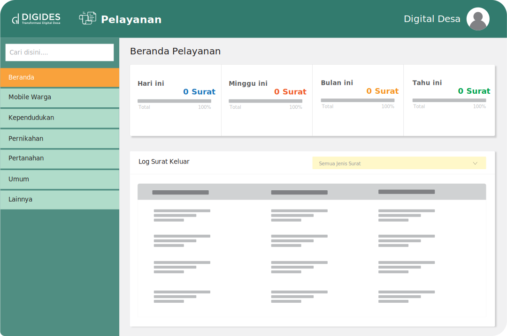

---

title: Pelayanan Desa
summary: >
  Sebuah aplikasi yang memberikan pelayanan kepada masyarakat dengan cepat, akurat, dan terpercaya. 
  Juga memberikan dampak yang sangat signifikan terhadap masyarakat dalam penggunaannya.
icon:
  src: https://digitaldesa.id/templates/homepage/media/misc/icon/digides_pelayanan.svg
  width: 70%

---

<feature-section id="utama">

# Pelayanan Desa

<feature-image>

</feature-image>

Aplikasi pelayanan desa yang dapat digunakan secara mandiri oleh masyarakat. 
Mempermudah masyarakat dalam administrasi, yang meliputi pelayanan administrasi umum, kependudukan, 
nikah, pertanahan dan PBB-P2

</feature-section>

## Fitur

<feature-section id="umum">

### Layanan Umum

<feature-image>

</feature-image>

Membantu masyarakat dalam mengakses berbagai layanan umum yang disediakan oleh pemerintah desa.
- Surat Keterangan Usaha
- Surat Keterangan Tempat Usaha
- Surat Keterangan Pengantar Barang
- Surat Keterangan Pengantar Ternak
- Surat Keterangan Tidak Mampu(Sekolah)
- Surat Keterangan Tidak Mampu(Umum)
- Surat Keterangan Rumah Tanggan Miskin Sekali
- Surat Keterangan Penghasilan Orang Tua
- Permohonan Izin Keramaian Pesta
- Surat Pengantar SKCK
- Surat Keterangan Ahli Waris
- Surat Keterangan Bepergian
- Surat Keterangan Tidak Berada di Tempat
- Surat Keterangan Beda Identitas
- Surat Keterangan Lainnya

</feature-section>
<feature-section id="kependudukan">

### Layanan Kependudukan

<feature-image>

</feature-image>

Akses mudah dan cepat untuk masyarakat dalam mengakses berbagai layanan kependudukan 
pemerintah desa.
- Biodata Penduduk
  - Formulir Kartu Keluarga(Pengganti F-1.01)
  - Formulir Pendaftaran Peristiwa Kependudukan(F-1.02)
  - Surat Pernyataan Tidak Memiliki Dokumen Kependudukan (F-1.04)
  - Surat Pernyataan Perubahan Data Kependudukan (F-1.05)
  - Formulir Biodata Penduduk Untuk Perubahan Data WNI (F-1.06)
  - Surat Kuasa Dalam Pelayanan Administrasi Kependudukan (F-1.07)
  - Formulir Permohonan KK Baru WNI(F-1.15)
  - Formulir Permohonan Perubahan KK Baru WNI (F-1.16)
  - Formulir Permohonan KTP (F-1.21)
  - Surat Keterangan Domisili
  - Surat Keterangan Hilang Kartu Keluarga
- Pindah
  - Surat Keterangan Pindah
  - Formulir Pendaftaran Perpindahan Penduduk (F-1.03)
  - Surat Keterangan Pindah Datang WNI Dalam Satu Desa/Kelurahan (F-1.24)
  - Surat Keterangan Pindah WNI Antar Desa/Kelurahan (F-1.26)
  - Surat Keterangan Pindah Datang WNI Antar Desa/Kelurahan (F-1.28)
  - Surat Keterangan Pindah WNI Antar Kecamatan (F-1.30)
  - Surat Keterangan Pindah Datang WNI Antar Kecamatan(F-1.32)
  - Surat Pengantar Pindah (F-1.33)
  - Surat Pengantar Pindah Datang (F-1.35)
  - Formulir Permohonan Pindah WNI Antar Provinsi (F-1.36)
  - Formulir Permohonan Pindah Datang WNI Antar Provinsi (F-1.38)
- Kelahiran
  - Surat Keterangan Kelahiran (F-2.01)
  - SPTJM Kebenaran dan Kelahiran
  - SPTJM Kebenaran Sebagai Pasangan Suami Istri
  - Surat Pernyataan Belum Memiliki Akta Kelahiran
- Kematian
  - Surat Keterangan Kematian (F-2.29)
  - Surat Kematian (A-5)
  - Surat Keterangan Penguburan

</feature-section>
<feature-section id="nikah">

### Layanan Nikah

<feature-image>

</feature-image>

Mempermudah masyarakat dalam mengurus berbagai administrasi dan keterangan nikah.
- Pengantar Nikah (N1-N6)
- Surat Keterangan Pernah Nikah
- Surat Keterangan Belum Pernah Nikah
- Surat Keterangan Duda/Janda

</feature-section>
<feature-section id="pertanahan">

<feature-image>

</feature-image>
### Layanan Pertanahan

Membantu masyarakat dalam pengurusan layanan pertanahan yang disediakan oleh pemerintah desa.
