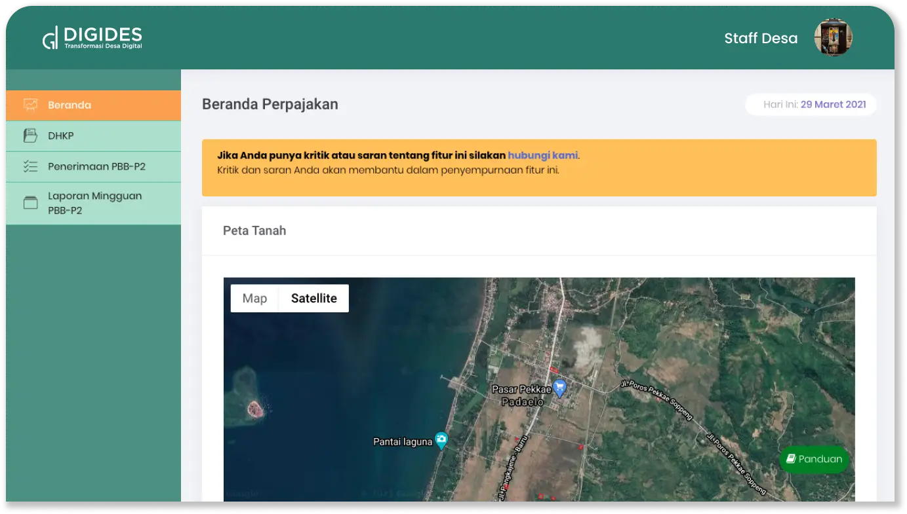
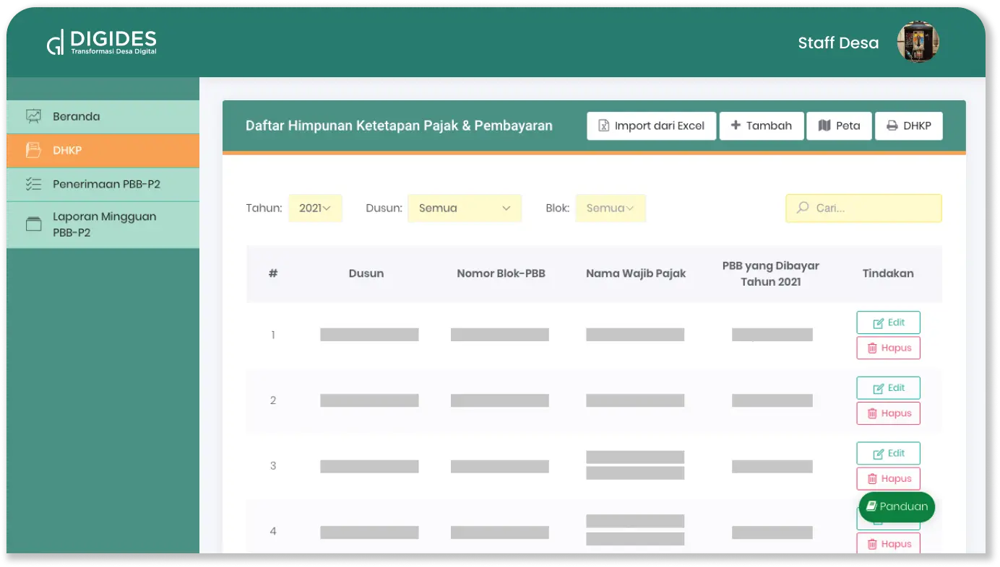
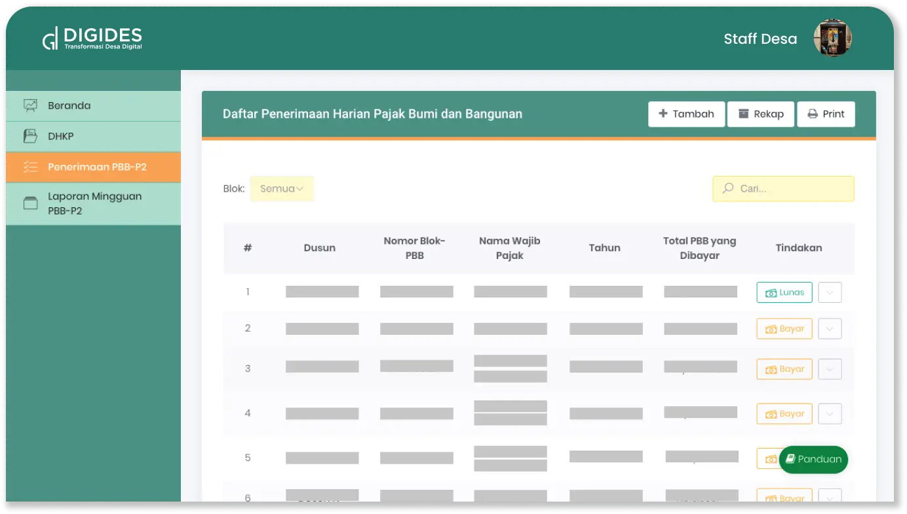
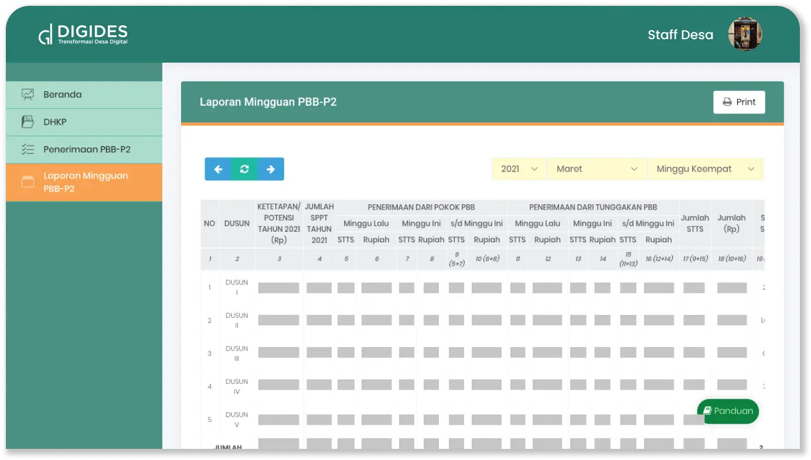

---

title: Perpajakan (PBB-P2)
summary: >
  Layanan khusus untuk memudahkan dalam pencatatan pajak di desa Anda mulai dari rekapitulasi perpajakan, 
  laporan perpajakan perminggu, dan lain-lain.
icon:
  src: solution/digides_perpajakan.svg
  width: 50%

---

<feature-section id="utama">

# Perpajakan Desa

<feature-image>

</feature-image>

PERPAJAKAN DIGIDES adalah layanan khusus untuk memudahkan dalam pencatatan pajak di desa Anda 
mulai dari rekapitulasi perpajakan, laporan perpajakan perminggu, data penerimaan harian pajak 
bumi dan bangunan, serta daftar himpunan ketetapan pajak dan pembayaran. Layanan ini juga 
menyediakan fitur untuk melihat status perpajakan beserta jumlah yang dibayar.

</feature-section>

## Fitur

<feature-section id="beranda">

### Beranda

<feature-image>

</feature-image>

Pada menu ini disajikan peta tanah dari daerah desa untuk memudahkan dalam visualisasi 
geografis desa terkait.

</feature-section>
<feature-section id="dhkp">

### DHKP

<feature-image>

</feature-image>

Fitur DHP atau Daftar Himpunan Ketetapan Pajak & Pembayaran merupakan fitur yang menampilkan 
letak objek pajak, nama wajib pajak serta besar pembayaran pajak terutang di desa Anda. 
Daftar tersebut dapat ditambahkan melalui import dari excel atau menambahkan secara manual.

</feature-section>
<feature-section id="penerimaan">

### Penerimaan PBB-P2

<feature-image>

</feature-image>

Pada menu disajikan daftar penerimaan PBB-P2. Daftar tersebut dapat ditambah direkap dan dicetak.

</feature-section>
<feature-section id="laporan">

### Laporan Mingguan PBB-P2

<feature-image>

</feature-image>

Membantu masyarakat dalam pengurusan layanan pertanahan yang disediakan oleh pemerintah desa.

</feature-section>